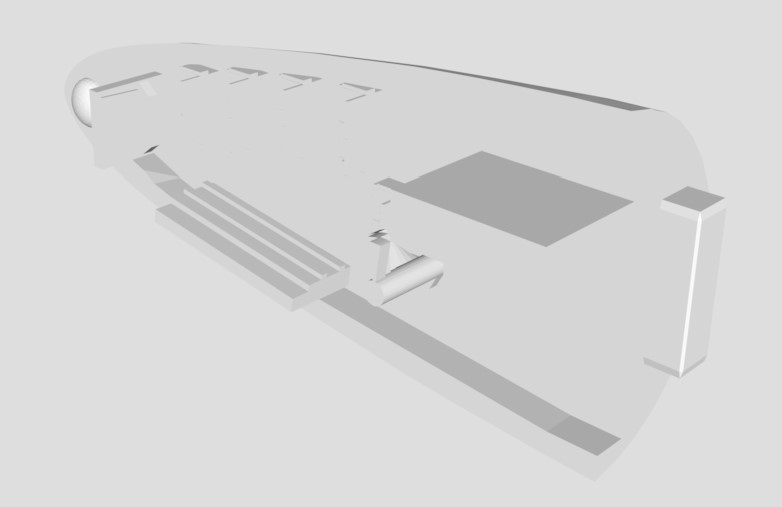
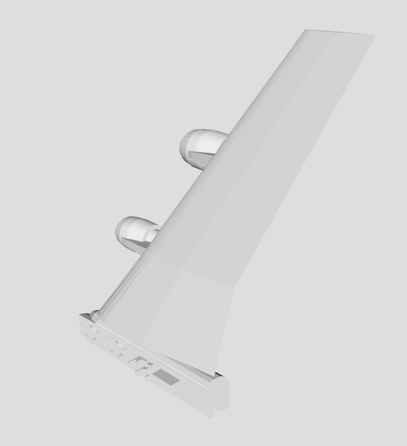
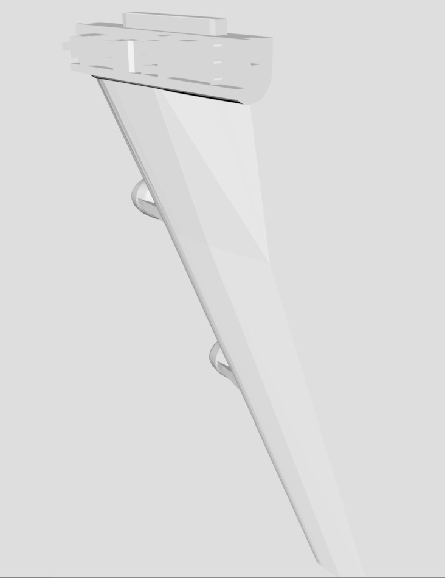
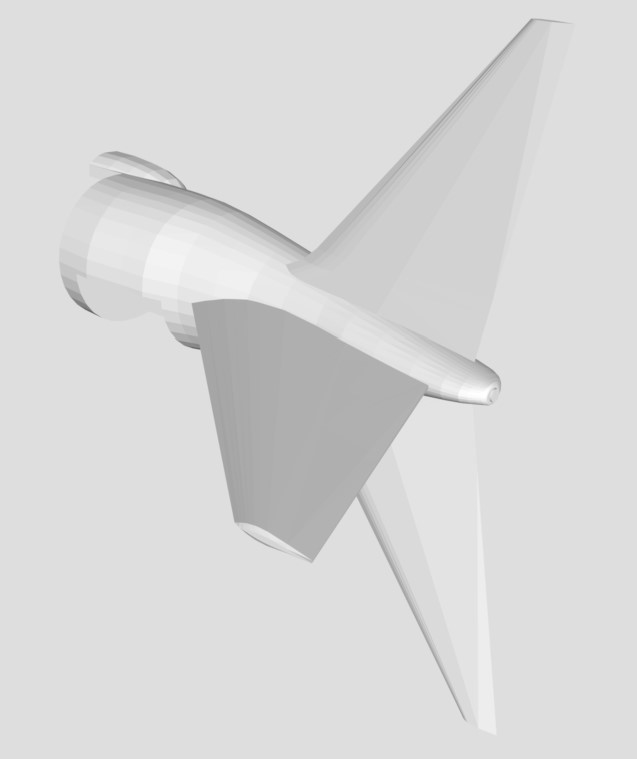
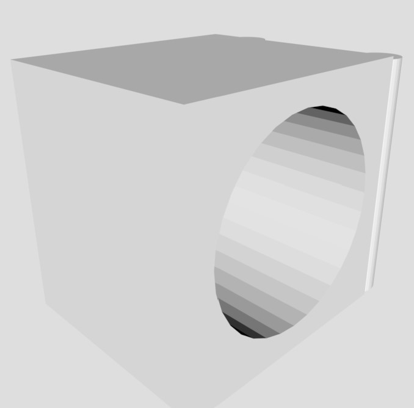
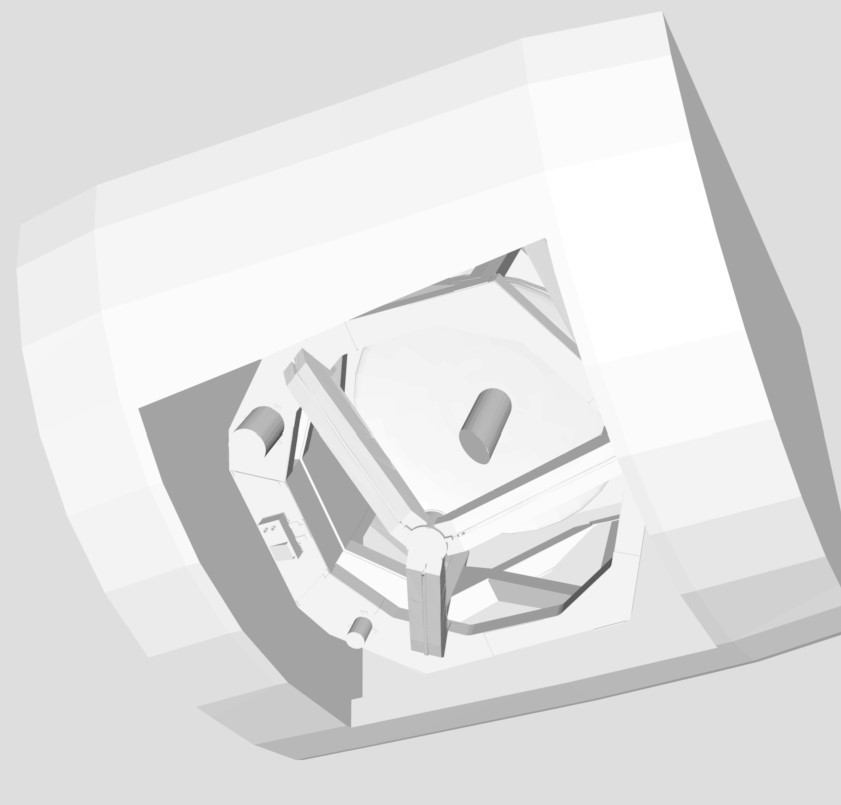
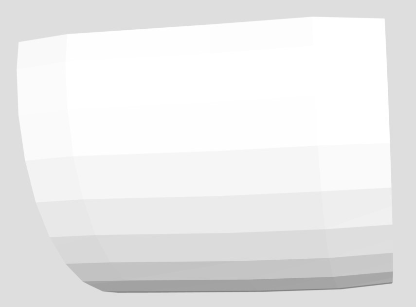
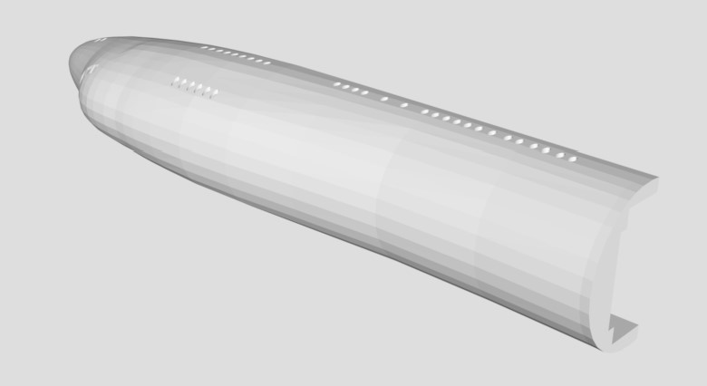

# Print your own 3D SOFIA model 
 
Now you can print your own 3D model of SOFIA, the Stratospheric Observatory for Infrared Astronomy. SOFIA is a modified Boeing 747SP aircraft that carries a 106-inch telescope, making it the largest airborne observatory in the world.  
 
# Introduction 
 
SOFIA flies higher than commercial jetliners to get above 99% of the water vapor in Earth’s atmosphere, which blocks infrared light from reaching the ground. This is why SOFIA is capable of making observations that are impossible for even the largest and highest ground-based telescopes. 
 
Scientists use SOFIA to study how stars and solar systems form, the atmospheres of other planets (like Jupiter) and moons (like Neptune’s moon Triton), comets, black holes, supernovae, and to identify complex molecules in space. SOFIA also promotes the development of new scientific instruments and fosters the education of young scientists and engineers. SOFIA makes 3-4 overnight flights each week, with each flight lasting 8-10 hours. 
 
SOFIA is a joint project of NASA (80%) and the German Aerospace Center, DLR (20%). NASA’s Ames Research Center in California’s Silicon Valley manages the SOFIA program, science and mission operations in cooperation with the Universities Space Research Association headquartered in Columbia, Maryland, and the German SOFIA Institute (DSI) at the University of Stuttgart. The aircraft is maintained and operated from NASA’s Armstrong Flight Research Center Hangar 703, in Palmdale, California. 
 
You can find more information about SOFIA at https://www.nasa.gov/sofia and at https://www.sofia.usra.edu/. 
 
For more details about the parts of the SOFIA aircraft and telescope, see the self-guided tour of SOFIA at https://www.sofia.usra.edu/sites/default/files/self-guided_tour.pdf, as well as the information below. For a virtual reality tour of SOFIA, check out the “NASA and DLR’s Flying Telescope SOFIA” Google Expedition at https://edu.google.com/expeditions/. 

# The model 
 
With the help of the NASA Ames SpaceShop Rapid Prototyping Facility, the SOFIA mission has created an eight-piece, 3D-printable model of the SOFIA 747SP aircraft. The printable files are at a 1/200 scale, with interior details and a removable upper fuselage section. This model features interchangeable open- and closed-telescope cavity configurations and telescope instruments. 
The model was has been simplified for durability and printing where needed. 

  
 
 

Table of Contents 
* [Preview](#the-model)
* [Model files](#model-files)
  * [Nose_section.stl](#nose-section-including-forward-aircraft-interior)
  * [Right_wing.stl](#right-wing-including-aircraft-interior)
  * [Left_wing.stl](#left-wing-including-aircraft-interior)
  * [Tail_section.stl](#tail-section)
  * [Instrument.stl](#interchangeable-instrument)
  * [Telescope_cavity_open.stl](#telescope-door-open-configuration-including-telescope)
  * [Telescope_cavity_closed.stl](#telescope-door-closed-configuration)
  * [Fuselage_top.stl](#fuselage-top-section)
*	[Printing tips](#printing-tips)
*	[Credits](#credits)

 
If you print and use this model, we would love to hear about your experiences. Please consider 
sharing a photograph by opening a [pull request](pulls), sharing it with SOFIA on social media @SOFIAtelescope, or contacting us at arc-sofia-contact@mail.nasa.gov. 

  
  
 

## Model files 

### Nose Section (Including Forward Aircraft Interior)

The forward part of SOFIA’s main deck still resembles the first-class section from the aircraft’s commercial days. These seats are used during takeoff and landing when the seats around the consoles and conference tables in the rear part of the cabin are full. This section also contains the lavatories, the galley and the staircase leading to the upper deck. 

Along one wall of the interior of the nose section are the mission controls and communications system (MCCS) racks. These are the computer systems that run the mission control stations and the headset system that the team uses to communicate. Headsets enable the team downstairs to easily communicate with each other and the flight crew upstairs. 

The cockpit is on the upper deck of the aircraft and is not shown in this model. SOFIA’s cockpit crew includes a pilot, copilot, flight engineer and navigator. The flight crew works closely with the mission director downstairs to ensure the observatory is in the right place at the right time to conduct its observations. The upper deck also features more seating and the engineering station computer racks. 

## Right Wing (Including Aircraft Interior) 

SOFIA is powered by four Pratt & Whitney JT9D-7J turbofan engines, rated at 50,000 pounds of thrust each. Two are on the right wing, and two are on the left. 

Interior details (front to back): 

*	Science Conference Table – Scientists from all over the world apply for time to use the telescope. When they fly to conduct their observations, they sit at these conference tables. 
*	Telescope Team Seats - German SOFIA Institute (DSI) engineers occupy these seats to test and monitor the telescope’s performance. 
*	Telescope Operators Station – These computers allow the telescope operators to control the telescope. They can move the telescope up and down, approximately 20-60 degrees above the horizon, to keep it pointed at the object the scientists are observing. The telescope cannot point down. 
*	Observatory Electronics Rack – These computers include the telescope cavity environmental control systems, as well as other control systems. 

## Left Wing (Including Aircraft Interior) 

Interior details (front to back): 
*	Airborne Astronomy Ambassadors (AAA) console – These displays provide a read-only view of the observations and telescope controls so teachers and other educators flying as part of the Airborne Astronomy Ambassadors can experience the research first-hand with the scientists. Educators bring their experience back to their classrooms and communities to inspire students to study and pursue careers in science, technology, engineering and math (STEM) fields. 
*	Mission Director and Science Flight Planner Seats – The mission director and flight planner manage all aspects of the flight here, ensuring that the pilots, telescope operators and instrument scientists are all working in sync. The pilots keep the aircraft on the carefully planned flight path, the telescope operators keep the telescope pointed at the right object, and the instrument scientists monitor the data collected. 
*	Science Instrument Team Station – The instrument scientists use these computers to monitor and manage the instrument throughout the flight. These tools (imagers, spectrometers and a polarimeter) analyze the light from SOFIA’s telescope. SOFIA’s instruments, each weighing hundreds of pounds, are interchangeable but can only be switched while the observatory is on the ground.  

## Tail Section 

SOFIA’s pressure bulkhead separates the open telescope cavity from the pressurized cabin when the telescope door is open. You can simulate this opening by swapping out the closed door configuration (Telescope_cavity_closed.stl) of this model for the open door configuration (Telescope_cavity_open.stl). See files for the two telescope cavity configurations below. 

## Interchangeable Instrument

Instruments to analyze light from SOFIA’s telescope are attached to the instrument-mounting flange on the cabin side of the pressure bulkhead. Because SOFIA lands after each flight, its scientific instruments can be exchanged, as well as repaired if necessary. New instruments can be developed to incorporate new technologies and extend SOFIA’s capabilities. This model comes with an interchangeable instrument to demonstrate this advantage. Print several of this instrument and swap them out depending on the scientific research your observatory model is conducting. 

## Telescope Door Open Configuration (Including Telescope)

SOFIA’s 2.7-meter (106-inch) diameter telescope was built in Germany by MAN Technologie AG and Kayser-Threde GmbH. The telescope collects radiation with wavelengths between 0.3 and 1600 microns and has an altitude range of approximately +20 to +60 degrees above the horizon. The telescope cannot point down. 
 
The telescope is mounted on a spherical bearing, which enables the telescope to stay still while the aircraft moves around it. The telescope assembly also contains 15 pneumatic isolators made of a specialized rubber that work like shock absorbers on a car to isolate the telescope from the aircraft’s vibration. 

## Telescope Door Closed Configuration

On the ground, SOFIA’s telescope bay door is kept closed to protect the telescope mirror and cavity from dust, sunlight and water. 

## Fuselage Top Section

The removable upper fuselage of this model allows you to look inside and see some of the inner workings of the observatory to get a feel for the many people (scientists, telescope operators, science instrument operators, mission director, flight planners and more) whose work and expertise are essential to every flight. 

# Printing Tips

We achieved the best results using the following settings: 
*	High print density 
*	Soluble support structure 
*	Existing file orientation (printer varying) 
 
Final parts may require sanding/gluing depending on material selection and printer tolerance 
We encourage you to open a [pull request](pulls) to add additional tips! 

# Credits

The 3D model files in this repository can also be found at [NASA 3D Resources](https://nasa3d.arc.nasa.gov/detail/sofia).  

Credits: 

The 3D-printable model of SOFIA was created by the SOFIA Mission Communications and Public Outreach Group with help from the NASA Ames SpaceShop Rapid Prototyping Facility. 

SOFIA Team 

*	Coral Clark - Airborne Astronomy Ambassadors co-manager 
*	Kassandra Bell - SOFIA social media lead 
*	Leah Strichartz - SOFIA public engagement specialist 
 
Photography 

-	Jake Killelea 
 
NASA Ames SpaceShop Rapid Prototyping Facility 

-	Randall Ticknor - intern 
-	Alex Mazhari - manager 
 
The following software was used to create the printable files: 

*	Blender 2.78b 
The contents of this repository are free to download and use. Please see the [Usage Guidelines](https://www.nasa.gov/multimedia/guidelines/index.html).
